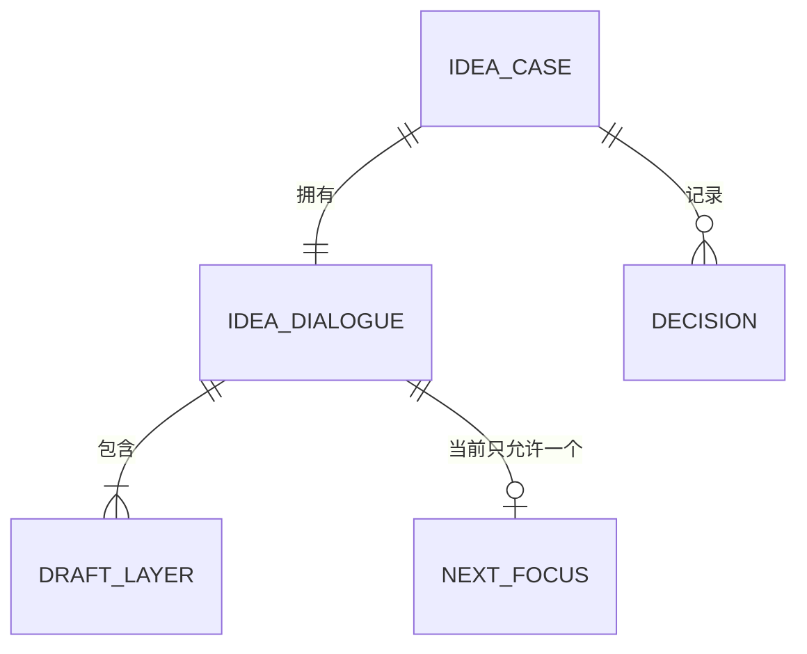
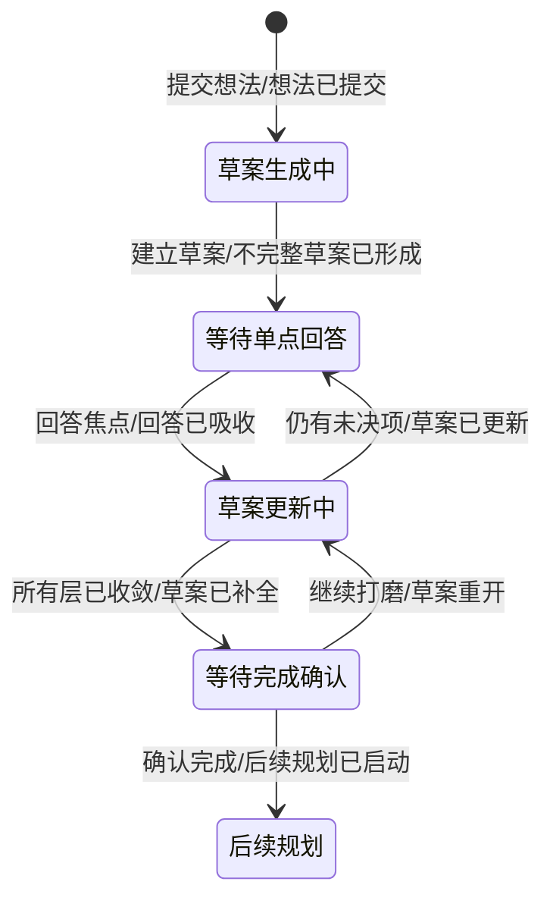
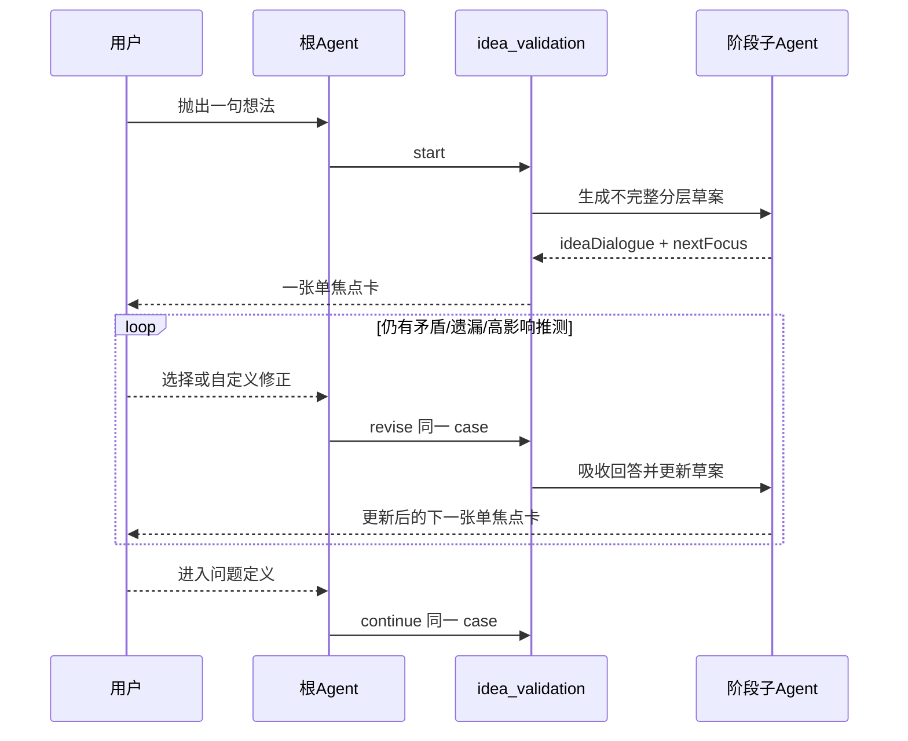
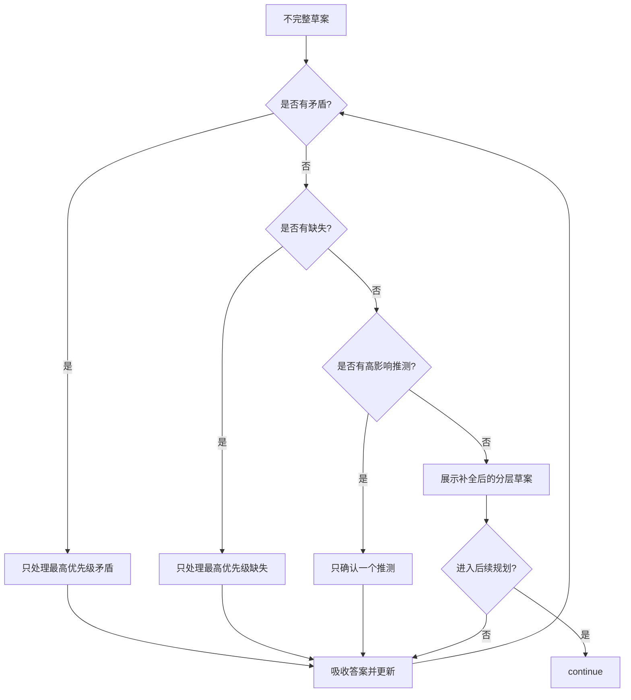

# 需求分析：交互式想法补全

# 人类卷

## A. 用户使用地图

| 角色 | 场景 | 任务 |
|---|---|---|
| 只有模糊想法的用户 | 想讨论而不是阅读 AI 一次性写完的长答案 | 先看到有层次、承认不完整的草案，再一轮只解决一个遗漏或矛盾 |

## B. 关键业务时刻

```text
想法已提交 → 不完整草案已形成 → 当前焦点已提出 → 回答已吸收 → 草案已更新 →（循环）→ 草案已补全 → 后续规划已启动
```

| 事件 | 触发者 | 用户得到什么 |
|---|---|---|
| 不完整草案已形成 | LLM | 六层结构以及已知、推测、缺失、矛盾状态，不是假完整答案 |
| 当前焦点已提出 | 系统 | 一张只处理一个关键变量的选择卡 |
| 回答已吸收 | 用户 | 当前缺口或矛盾被修正，不重复回答其他层次 |
| 草案已更新 | LLM | 能看到本轮改变以及下一个焦点 |
| 草案已补全 | 系统 | 关键层次全部确认或明确不适用，才允许进入后续规划 |

## C. 关键业务规则

- **Do**：先把原始想法整理成有层次但明确不完整的草案；每层显示来源状态。
- **Do**：矛盾优先于遗漏，遗漏优先于普通推测；每轮只讨论一个决策变量。
- **Do**：每次回答都更新同一 case、同一份草案，并展示进度与本轮变化。
- **Don't**：不得第一轮生成看似完整的六维内容让用户整体确认。
- **Don't**：不得一次展开六张卡、把多个问题塞进一张卡，或把推测升级为用户事实。

## D. 需求问题清单

| # | 类 | 一句话问题 | 已拍板结论 |
|---|---|---|---|
| P0-1 | ⚔️ | “不让用户填表”是否等于“AI 一次性补全”？ | 不等于；AI 只搭结构和候选，完整性通过多轮共同形成 |
| P0-2 | 🕳️ | 多轮对话如何知道下一步谈什么？ | 按矛盾→缺失→高影响推测排序，每轮只产生一个 nextFocus |
| P0-3 | 🕳️ | 何时结束完善阶段？ | 六层均为 confirmed 或 not-applicable，且 nextFocus=none |

<!-- AI工作底稿 ↓ -->

# AI 工作底稿

## 〇、Why / What / How

- **Why**：保留对话的层次、节奏和共同推演感，避免完整长文造成无法沟通。
- **What**：六层不完整草案、状态标记、单焦点卡、逐轮更新、完成门禁。
- **How**：`ideaDialogue` 持久化层次与焦点；clarify 的 `revise` 变成一次对话步，只有完成门禁的 `continue` 才进入 frame。
- **不做**：首轮完整脑补、六卡批量审核、开放式填表、自动跳过人工答案。

## 一、事件风暴

| 命令 | 聚合 / 不变条件 | 事件 |
|---|---|---|
| 提交想法 | IdeaCase；保留原文 | 想法已提交 |
| 建立分层草案 | IdeaDialogue；必须至少有一个 unresolved 层 | 不完整草案已形成 |
| 选择当前焦点 | 一轮只能有一个；矛盾优先 | 当前焦点已提出 |
| 回答当前焦点 | caseId/revision 匹配；不得跳题 | 回答已吸收 |
| 更新分层状态 | 已确认内容不可静默覆盖 | 草案已更新 |
| 完成草案 | 所有层 confirmed/not-applicable | 草案已补全 |
| 进入后续阶段 | 只有完成门禁可 continue | 后续规划已启动 |

## 二、四图









## 三、数据与异常边界

| 字段 | 规则 |
|---|---|
| layers | 固定六层：目标价值、用户场景、范围边界、关键机制、约束资源、成功标准 |
| layer.status | confirmed / inferred / missing / conflict / not-applicable |
| layer.content | missing 可空；其他状态必须非空 |
| nextFocus | unresolved 时必须恰好一个，且引用对应 layer id |
| nextFocus.options | 2–4 个直接回答当前变量的候选；自定义输入用于纠正 |
| progress | resolved/total 可复算，total 固定 6 |

| 异常 | 行为 |
|---|---|
| 首轮六层全完成 | 当前阶段校验失败，只修复 clarify |
| 焦点引用已完成层 | 当前阶段校验失败 |
| 用户跳过卡片 | 等待，不推进 revision |
| 回答后仍返回同一焦点且无解释 | 允许一次修复；不得静默死循环 |
| 完成门禁仍有 unresolved | 拒绝进入 frame |

## 四、验收标准

| # | Given | When | Then / 事件 |
|---|---|---|---|
| AC1 | 用户只给一句模糊想法 | 首阶段结束 | 不完整草案已形成，至少一个层次为 inferred/missing/conflict |
| AC2 | 当前存在多个未决层 | 门禁呈现 | 只出现一张卡且只处理 nextFocus 对应变量 |
| AC3 | 用户回答当前卡 | 工作流推进 | 使用 `revise` 更新同一 case，草案已更新并产生下一焦点 |
| AC4 | 草案仍有冲突与缺失 | 选择下一焦点 | 冲突先于缺失，缺失先于推测 |
| AC5 | 六层均 confirmed/not-applicable | 门禁呈现 | 草案已补全，才显示进入问题定义选项 |
| AC6-反 | 任一层仍 unresolved | 尝试 continue | 不发生后续规划已启动 |

## 反馈（skill_run）

```yaml
skill_run:
  skill: requirement-analyst
  plan: Plans/需求分析/2026-08-28-交互式想法补全.md
  date: 2026-08-28
  contexts_used:
    - path: Contexts/需求分析/需求分析规范.md
      utility: high
      reason: "用事件链和状态机把一次确认纠正为可循环的单焦点对话"
    - path: Templates/需求分析-带验收标准模板.md
      utility: high
      reason: "用于组织人类卷、数据边界与可测 AC"
    - path: Templates/模板约定.md
      utility: high
      reason: "用于分卷与 Plan 状态约束"
    - path: Contexts/决策/Skill反馈协议.md
      utility: high
      reason: "用于记录本次返工的需求分析反馈"
  contexts_missing: []
  contexts_stale: []
  outcome_status: pass
  friction: "上一版把低认知负担错误实现为一次性完整脑补，缺少逐轮共同建模"
  revisit_needed: true
  revisit_reason: "用户指出完整确认卡没有层次、步骤和可沟通过程，需重开首阶段设计"
```
