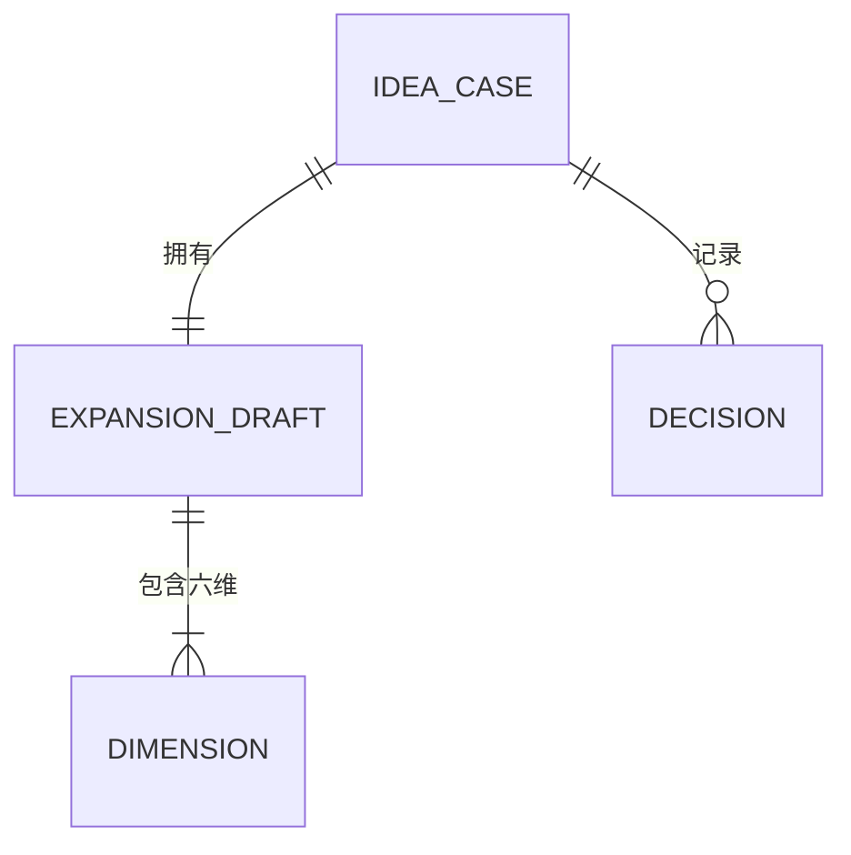
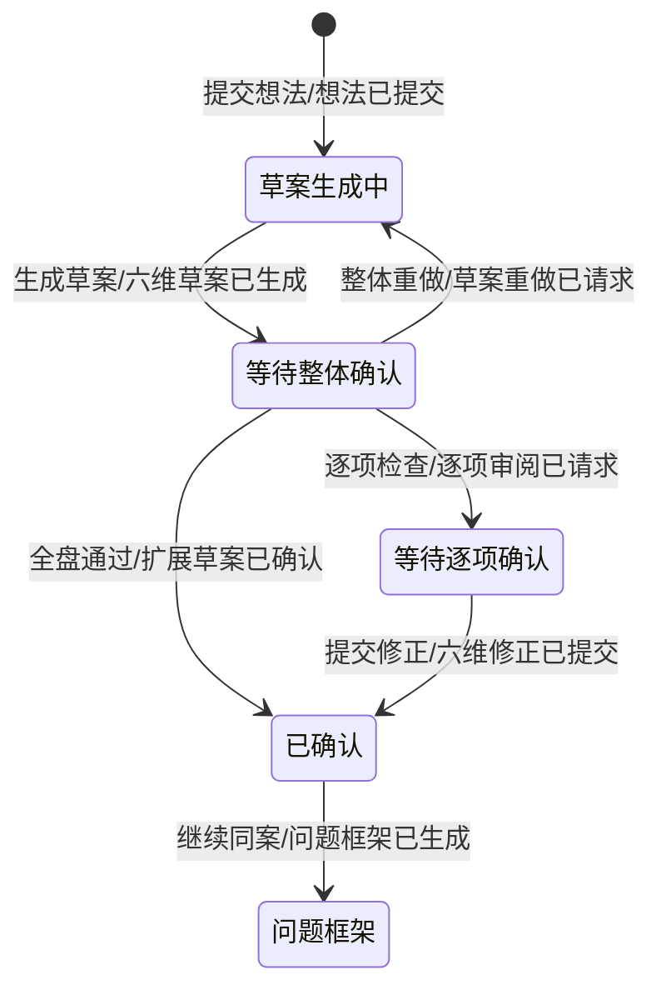
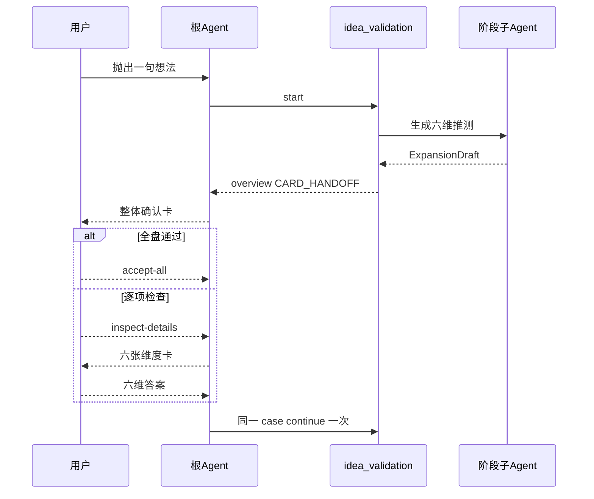
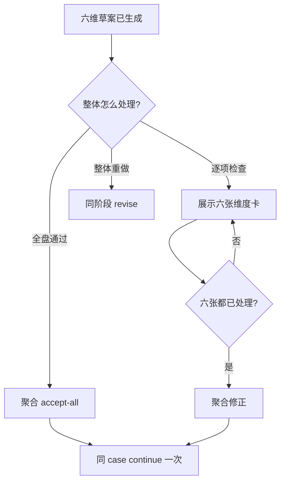

# 需求分析：强行脑补与轻量确认

> 已由 `Plans/需求分析/2026-08-28-交互式想法补全.md` 替代：一次性完整脑补缺少层次、步骤和共同推演过程，仅保留为 `0.5.0` 历史设计记录。

# 人类卷

## A. 用户使用地图

| 角色 | 场景 | 任务 |
|---|---|---|
| 有模糊点子的用户 | 只想快速丢下一句话，不愿填写需求表 | 看到 AI 主动补全的默认蓝图，只标记不认同之处 |

## B. 关键业务时刻

```text
想法已提交 → 六维草案已生成 → 整体审阅方式已选择 →（可选：六维修正已提交）→ 扩展草案已确认 → 问题框架已生成
```

| 事件 | 触发者 | 用户得到什么 |
|---|---|---|
| 想法已提交 | 用户 | 一句话想法进入同一 case |
| 六维草案已生成 | LLM | 带明确“推测”标记的目标、用户、路径、风险、资源、交付物 |
| 整体审阅方式已选择 | 用户 | 全盘通过、逐项检查或整体重做 |
| 六维修正已提交 | 用户 | 只修改偏移项，未修改项默认接受 |
| 扩展草案已确认 | 系统 | 一次性推进同 case，不重复 start |

## C. 关键业务规则

- **Do**：无追问地生成六维假设；推测必须显式标记；支持“一键全盘通过”和“按六维逐项检查”。
- **Do**：逐项检查时一维一张卡；采用用选择项，修正用该卡的自定义输入，删除用明确选项。
- **Don't**：不得把推测写成用户事实、已验证证据、真实预算、真实组织授权或承诺。
- **Don't**：不得在用户选择“逐项检查”后直接推进；六张卡全部处理后才能继续一次。

## D. 需求问题清单

| # | 类 | 一句话问题 | 已拍板结论 |
|---|---|---|---|
| P0-1 | ⚔️ | “全盘通过”与“六张逐项卡”如何同时做到低操作量？ | 两级收敛：先整体卡；选逐项检查才展开六卡 |
| P0-2 | ⚔️ | 强行脑补是否会污染后续证据？ | 所有脑补只进入 assumption draft，不进入 evidence |
| P0-3 | 🕳️ | 用户逐项选择“修正”却不填内容怎么办？ | 不提供空洞“修正”按钮；直接使用卡片自定义输入承载修正 |

<!-- AI工作底稿 ↓ -->

# AI 工作底稿

## 〇、Why / What / How

- **Why**：把“创造答案”的认知负担改成“识别偏差”，减少首次输入后的流失。
- **What**：首阶段生成六维扩展草案；整体确认或逐项做减法；确认后进入现有 frame，而非再次开放式追问。
- **How**：扩展草案结构化存储；根 Agent 执行 overview → detail 的条件卡片协议；状态机保持 revision 乐观锁与一次推进不变式。
- **不做**：不输出未经标记的组织事实；不直接生成最终实施计划；不以 800 字正文作为主要交互面。

## 一、事件风暴

| 命令 | 聚合 / 不变条件 | 事件 |
|---|---|---|
| 提交想法 | IdeaCase；原文不可改写 | 想法已提交 |
| 生成六维草案 | ExpansionDraft；六维齐全且全部是推测 | 六维草案已生成 |
| 选择全盘通过 | Gate；caseId/revision 必须匹配 | 扩展草案已确认 |
| 选择逐项检查 | Gate；不得推进 revision | 逐项审阅已请求 |
| 提交六维修正 | Gate；六维答案齐全 | 六维修正已提交 |
| 继续同一 case | IdeaCase；每个 gate 最多一次 continue | 问题框架已生成 |

## 二、四图









## 三、数据与异常边界

| 字段 | 规则 |
|---|---|
| mission / successMetric | 非空；必须以推测语气呈现 |
| audiences | 恰好 3 个候选画像，不声称是真实用户数据 |
| primaryRoute / alternativeRoutes | 1 条主路线 + 2 条备选 |
| risks | 恰好 3 个待验证风险 |
| resources | 人力、预算、时间均为估算区间或假设 |
| deliverables | 1–3 个可观察交付物 |

| 异常 | 行为 |
|---|---|
| overview 跳过 | 等待，不推进 |
| 逐项卡有跳过 | 等待，不推进 |
| revision 陈旧 | 拒绝 continue |
| LLM 缺维度或把推测写成证据 | 只修复当前阶段一次 |

## 四、验收标准

| # | Given | When | Then / 事件 |
|---|---|---|---|
| AC1 | 用户只提交一句模糊想法 | 首阶段完成 | 六维草案已生成，且没有向用户提问 |
| AC2 | 六维草案存在 | 用户选择全盘通过 | 只发生一次扩展草案已确认，并同 case 继续 |
| AC3 | 六维草案存在 | 用户选择逐项检查 | 出现六张一维一卡的确认卡，revision 不变 |
| AC4 | 六张卡全部处理 | 用户提交 | 六维修正已提交，未修改项按默认接受，只 continue 一次 |
| AC5-反 | 任一答案跳过或工具取消 | 根 Agent处理结果 | 不发生问题框架已生成 |
| AC6-反 | 草案含未经标记的事实/证据 | 宿主校验 | 当前阶段被修复或失败，不进入门禁 |

## 反馈（skill_run）

```yaml
skill_run:
  skill: requirement-analyst
  plan: Plans/需求分析/2026-08-28-强行脑补与轻量确认.md
  date: 2026-08-28
  contexts_used:
    - path: Contexts/需求分析/需求分析规范.md
      utility: high
      reason: "用事件链、状态机和异常边界解决全盘通过与逐项确认的交互冲突"
    - path: Templates/需求分析-带验收标准模板.md
      utility: high
      reason: "用于组织人类卷、AI底稿与可测AC"
    - path: Templates/模板约定.md
      utility: high
      reason: "用于分卷与Plan状态规范"
    - path: Contexts/决策/Skill反馈协议.md
      utility: high
      reason: "用于记录本次需求分析反馈"
  contexts_missing: []
  contexts_stale: []
  outcome_status: pass
  revisit_needed: false
```
